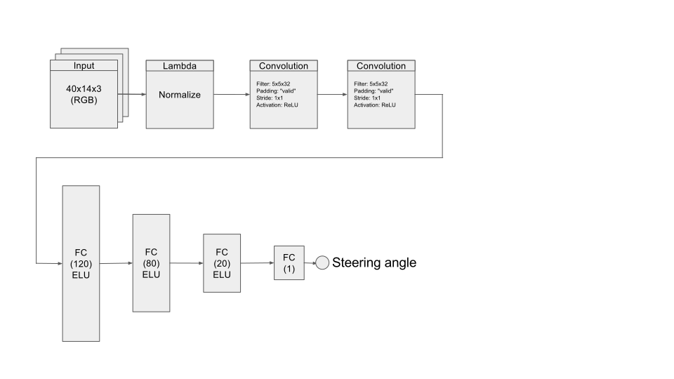
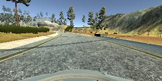
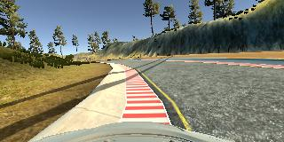
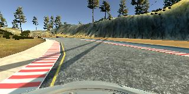
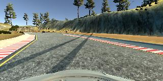
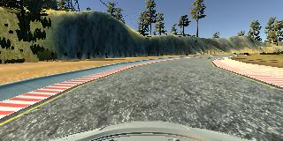
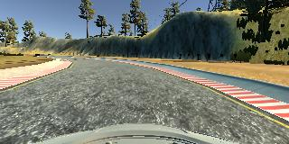

#**Behavioral Cloning** 
---

**Behavioral Cloning Project**

The goals / steps of this project are the following:
* Use the simulator to collect data of good driving behavior
* Build, a convolution neural network in Keras that predicts steering angles from images
* Train and validate the model with a training and validation set
* Test that the model successfully drives around track one without leaving the road
* Summarize the results with a written report


## Rubric Points
Here I will consider the [rubric points](https://review.udacity.com/#!/rubrics/432/view) individually and describe how I addressed each point in my implementation.  

---
###Files Submitted & Code Quality

####1. Submission includes all required files and can be used to run the simulator in autonomous mode

My project includes the following files:
* model.py containing the script to create and train the model
* drive.py for driving the car in autonomous mode
* model.h5 containing a trained convolution neural network 
* writeup.md summarizing the results

####2. Submission includes functional code
Using the Udacity provided simulator and my drive.py file, the car can be driven autonomously around the track by executing 
```sh
python drive.py model.h5
```

####3. Submission code is usable and readable

The model.py file contains the code for training and saving the convolution neural network. The file shows the pipeline I used for training and validating the model, and it contains comments to explain how the code works.

###Model Architecture and Training Strategy

####1. Current model architecture



Here is a description of the network used for this project (diagrammatically shown above)...

1. Input layer: (14,40,3)
1. Lambda layer for normalization.
1. Conv2D layer for feature extraction. It uses ReLU activation for non-linearity.
1. Second Conv2D layer for higher level feature extraction. Also uses ReLU activation.
1. A Flatten() layer to flatten the convolved output for use in the fully connected layers.
1. A Dense() layer with 120 neurons, with ELU activation for non-linearity.
1. A Dense() layer with 80 neurons, with ELU activation for non-linearity.
1. A Dense() layer with 20 neurons, with ELU activation for non-linearity.
1. A single Dense() neuron without any activation for the final steering angle output.

####2. Solution Design Approach

The overall strategy for deriving a model architecture was to use the smallest possible network which got the job done. A small image works well with a small network therefore I directed my efforts towards using a small image. I cropped and resized a few test images until they were 40x14 pixels in size and then inspected them visually. They were perfectly fine for driving on the given track! So I decided to proceed with this image size.

As a side effect this made the input more useful by removing unnecessary details. Also the distiction between the track and its background became more prominent. 

Then I started with a single neuron and trained it on the Udacity data set. It did not do very well. So I switched to two neurons in cascade, it had the same performance as a single neuron. Next I used 10 neurons as the first layer connected to a single output neuron. It did much better than the previous models. This 11 neuron network was able to keep the car on the track for straight runs of the track but the vehicle veered off course when the track boundary was not clearly demarcated and had other objects on it.

And since I had already inspected the cropped and scaled down images visually and found them to be suitable for this task it lead me to believe the network had a hard time detecting important features in the input image. This called for a Conv2D layer as the first layer. I attached a single Conv2D unit as the first layer in front of the previous 11 neuron network. This improved the performance significantly at complex boundaries but there was still some room for improvement so I added a second Conv2D layer. This was the first iteration where the vehicle completed one lap successfully without completely going off course. I also tried a third Conv2D layer but later removed it since it did not seem to help much.

After several trial and error experiments on similar lines I settled on the current model architecture (described in the previous section).

#####A note on the training hyper parameters 

I noticed that I was getting very low values for training and validation accuracy but the model seemed to work anyway. This may have been an issue with the way acccuracy is calculated for linear outputs by Keras. For example in real use a steering angle close to the value used in training is good enough but the accuracy calculation algorithm may be expecting an exact match.

So I guess a low mean squared error was all I needed. And it seemed to go down with increasing number of epochs so I ran the training process for about 15 epochs with a batch size of 64 images. Running the training longer led to jittery steering angle predictions and a wildly swerving vehicle.

At the end of the process, the vehicle was able to drive autonomously around the track without leaving the road.

####3. Attempts to reduce overfitting in the model

The model was trained and validated on different data sets to ensure that the model was not overfitting. The model was tested by running it through the simulator and ensuring that the vehicle was able to stay on the track.

Adding even a small amount of dropout (~0.1) made matters worse significantly so it was not used. It seems the model is small enough already (w.r.t. to the amount of training data used).

####4. Model parameter tuning

The model used an adam optimizer, so the learning rate was not tuned manually.

####5. Appropriate training data

Training data was chosen to keep the vehicle driving on the road. I used a combination of center lane driving, recovering from the left and right sides of the road and driving on the track in the reverse direction. In addition to this I also used flipped images and images from the left and right cameras with steering adjust.

For details about how I created the training data, see the next section. 


####6. Creation of the Training Set & Training Process

To capture good driving behavior, I first recorded seven laps on track one using center lane driving. Here is an example image of center lane driving:



I also recorded two laps in the opposite direction to help the network regularize.

I then recorded the vehicle recovering from the left side and right sides of the road back to center so that the vehicle would learn to do this by itself when it goes too much to the right or left. These images show what a recovery looks like starting from...





To augment the data set, I also flipped images and angles to help the network regularize (prevent overfitting). For example, here is an image along with its flipped counterpart:




After the collection process, I had about 60,000 data points. I preprocessed this data by removing the top 48 rows and resizing it to one eighth of its original size.

I finally randomly shuffled the data set and put 20% of the data into a validation set. 

I used this training data for training the model. The validation set helped determine if the model was over or under fitting. The ideal number of epochs was 10 as evidenced by the result. I used an adam optimizer so that manually training the learning rate wasn't necessary.
